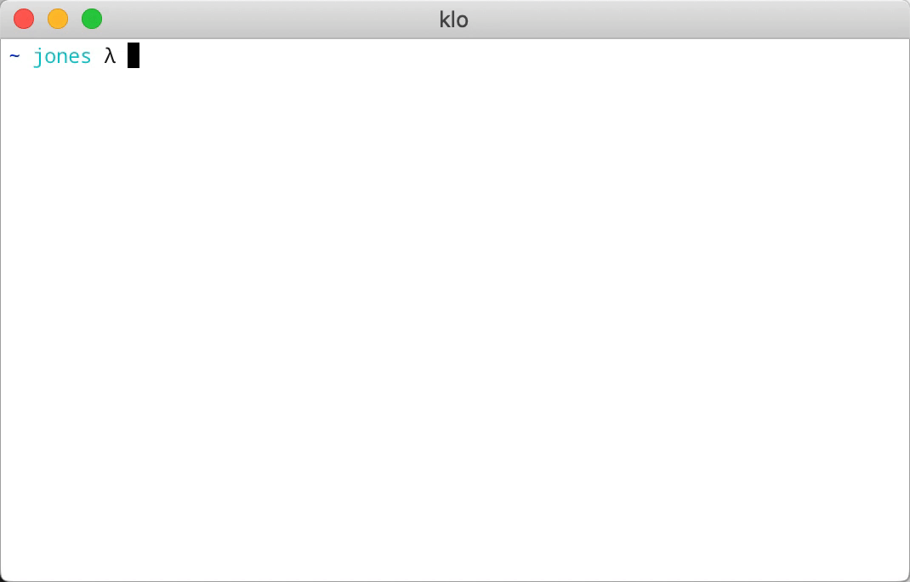

# kube-locate
An interactive CLI to navigate Kubernetes contexts and namespaces.  

## klo(1)
```
usage: klo <context> <namespace>
           <context | namespace-in-current-context>
           (no arguments for interactive mode)
```

I'm working on this tool as a project to work on while learning Rust. I still have a lot to learn, but I think this should be useful in its current form for MacOS and Linux. I regularly use [kubectx and kubens](https://github.com/ahmetb/kubectx/) from the command line (thank you @ahmetb!), but always wished it worked a bit differently.

### Interactive Mode


Without any arguments the list of available contexts is presented first, followed by the list of namespaces in that context.  

Use the up and down arrow keys or 'j' and 'k' on the home row.

### Normal Mode



Provide a context and namespace as the first and second arguments to go straight there.
```shell
klo docker-desktop kube-system
```

For quickly switching contexts or namespaces provide 1 argument: the desired context or namespace (in the current-context).
```shell
klo docker-desktop

klo kube-system
```

## Installation

Download the latest release and source for linux and MacOS in the [GitHub releases](https://github.com/senoja/kube-locate/releases) or use the instructions below.  

### MacOS

#### Homebrew

```shell
brew tap senoja/formulas
brew install kube-locate
```

#### curl

```shell
curl -L https://github.com/senoja/kube-locate/releases/download/v0.1.0/kube-locate-v0.1.0-x86_64-apple-darwin.tar.gz | tar xz -C /usr/local/bin
```

### Linux

#### curl

```shell
curl -L https://github.com/senoja/kube-locate/releases/download/v0.1.0/kube-locate-v0.1.0-x86_64-unknown-linux-musl.tar.gz | tar xz -C /usr/local/bin
```

## Ideas

- there can be lag when retrieving the namespaces after selecting a context to switch to: it would be nice to poll for the namespaces on boot while the user selects the context and in some cases render faster
- type ahead filter in interactive mode
- fuzzy matching in normal mode
- allow user configuration:
  - highlight (invert and bold?)
  - interactive mode (arrow keys, vim jk, type ahead, etc.)
